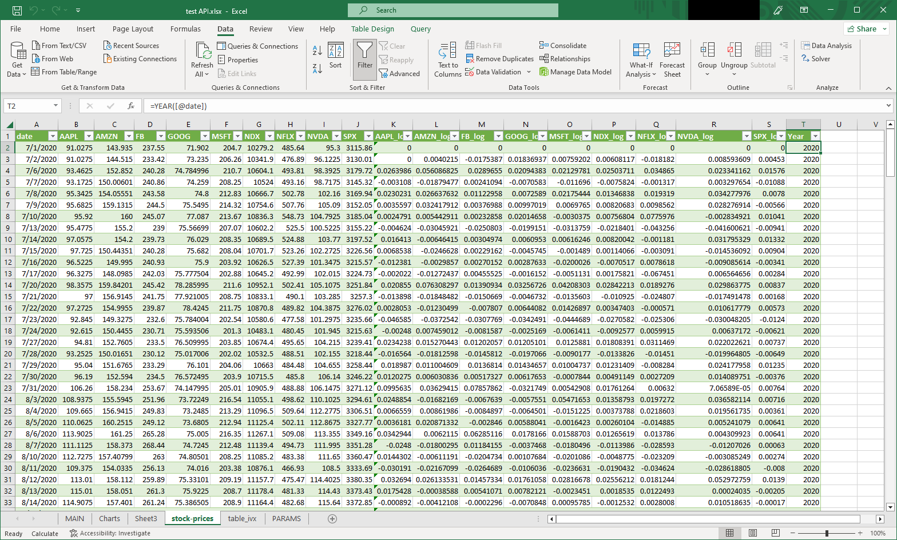
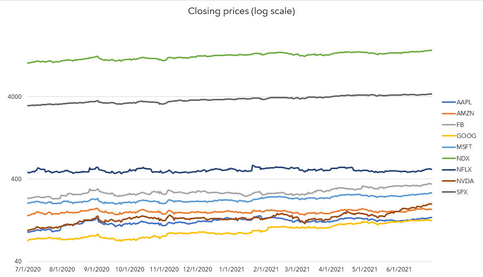
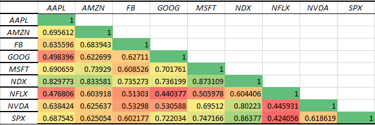

# Example of how to use the IVolatility Rest API with Excel

## Requirements
- Microsoft Excel 2016 or later
- Microsoft Power Query 
   - To learn more about Microsoft Power Query, please visit Microsoft’s <a href="https://learn.microsoft.com/en-us/power-query/" target="_blank">official documentation</a>.
- [test API.xlsx](https://github.com/IVolatility-com/API-in-Excel/raw/main/test%20API.xlsx)
  - This is IVolatility’s prepared worksheet that demonstrates the use of the API.
## User Guide
   1. Open [test API.xlsx](https://github.com/IVolatility-com/API-in-Excel/raw/main/test%20API.xlsx) Excel file and switch to the **PARAMS** worksheet

         

      For this example, we are using two historical endpoints:

      - <a href="https://redocly.github.io/redoc/?nocors&url=https://restapi.ivolatility.com/api-docs#tag/EOD-Equities/operation/EOD%20Equity%20Prices" target="_blank">**/equities/eod/stock-prices**</a>
      - <a href="https://redocly.github.io/redoc/?nocors&url=https://restapi.ivolatility.com/api-docs#tag/EOD-Equities/operation/EOD%20Equities%20IVX" target="_blank">**/equities/eod/ivx**</a>
        - The **IVX**, short for Implied Volatility Index, is calculated by using raw IV data with a proprietary weighting technique, factoring the delta and vega of each option.
        - You may also visit <a href="https://en.wikipedia.org/wiki/IVX" target="_blank">Wikipedia</a> for more info on the IVX.

      The above endpoints take the following take login info, date-range, and stock symbol as parameters:

      - **username**
      - **password**
      - **From** 
      - **To**
      - **ticker**

      The IVX, short for Implied Volatility Index, is calculated by using raw IV data with a proprietary weighting technique, factoring the delta and vega of each option.

      <!--- For more information on the IVX, please visit IVolatility’s <a href="https://redocly.github.io/redoc/?nocors&url=https://restapi.ivolatility.com/api-docs#tag/EOD-Equities/operation/EOD%20Equities%20IVX" target="_blank">documentation</a>, as well as <a href="https://en.wikipedia.org/wiki/IVX" target="_blank">Wikipedia</a>.

      Within IVolatility’s documentation, you may also find <a href="https://redocly.github.io/redoc/?nocors&url=https://restapi.ivolatility.com/api-docs#tag/EOD-Equities/operation/EOD%20Equity%20Prices" target="_blank">more information</a> on the EOD stock price data. -->

   2. After inputting the necessary parameters, from the menu, select **Data** and click on **Refresh All**

         

   3. The retrieved stock price and volatility data from the IVolatility API will be loaded into the corresponding **stock-prices** and **table\_ivx** worksheets:

      - **stock-prices**

         

         Next to the price data, the table also contains logarithmic returns for each of the stocks, indicated by “\_log”.

      - **table-ivx**

         

   4. Within the **Charts** worksheet, you will find the following helpful metrics:
   
      - log-scale price chart of all the stocks in the portfolio:

         

      - correlation matrix:

         

         The correlation matrix can be calculated with Excel’s **Data Analysis** toolkit:

         

         After clicking on **Data Analysis**, select **Correlation** and press **OK**:

         

         The correlation matrix tool will pop up:

         

         You will need to select the **Input Range** and **Output Range**, then press **OK**:

         

         Excel will then calculate and output the correlation matrix. After a bit of formatting, it may look similar to the above correlation matrix.

      - risk-return chart of the stocks in the portfolio:

         

   5. On **Sheet3**, with the use of regression modelling and the correlation matrix, you will find all of the portfolio calculations on the retrieved datasets. They include the annualized returns (APR), volatility (IVX and standard deviations), R2 scores and correlations of each of the stocks with respect to the Nasdaq index.

         

   6. And, finally, in the **MAIN** worksheet, you will find the individual stocks’, as well as the aggregate portfolio’s, alpha and beta stats.

         

